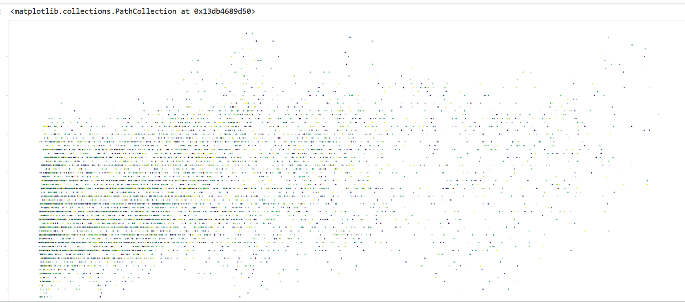
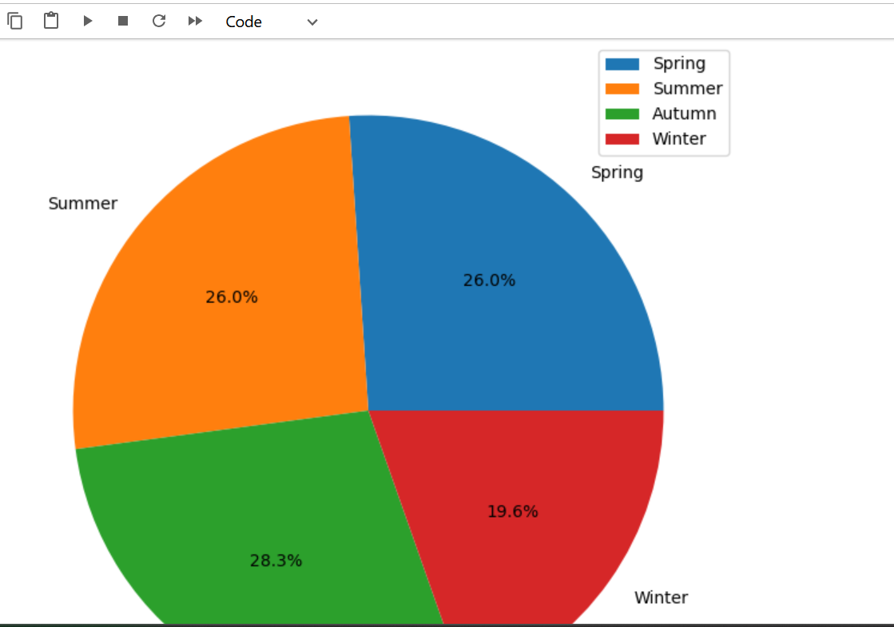

# 🚲 Bike Share London Data Analysis

This project explores bike-sharing trends in London using a publicly available dataset. The goal was to analyze how factors like temperature, season, humidity, and wind speed affect bike usage across different times and conditions.

## 📊 Key Questions Explored
- What season sees the highest bike share count? 
- Does temperature affect the number of bike shares?
- How do weather conditions like humidity and wind speed influence rides?

## 🔧 Tools Used
- Python: pandas, NumPy, matplotlib
- Jupyter Notebook for analysis and visualization

## 🔍 Highlights
- Cleaned dataset and renamed columns for clarity
- Grouped data by season and calculated averages
- Found bike counts at extreme weather conditions
- Visualized trends using scatter and pie charts

## 📈 Sample Visuals

*Bike shares by temperature*

*Distribution of bike shares across seasons*

## 🚀 Future Enhancements
- Add Streamlit dashboard to visualize trends interactively
- Explore additional weather codes or time series forecasting
- Automate analysis using script functions

## 📁 Dataset
The dataset was sourced from [kaggle](https://www.kaggle.com/datasets/hmavrodiev/london-bike-sharing-dataset). It contains hourly data on bike shares along with environmental features like temperature, humidity, and season indicators.

